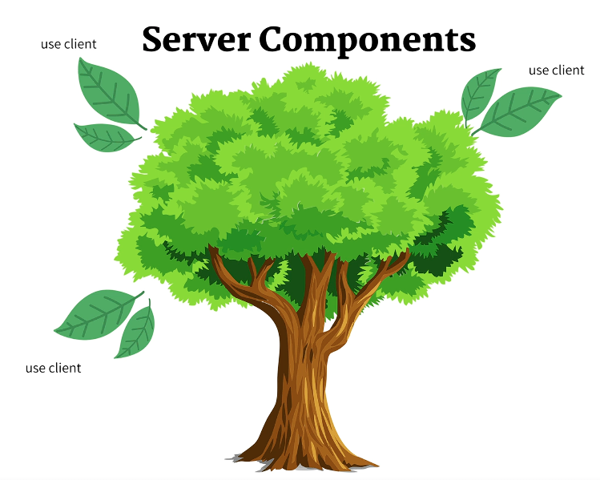

## Vista de nuestra app

## Archivos de configuración

  - TSConfig.json
    Indica cómo el compilador de typescript trabajará

  - postcss.config.js
    Transforma CSS mediante plugins.

    Ejemplo:
    - autoprefixer
    - postcss-preset-env

